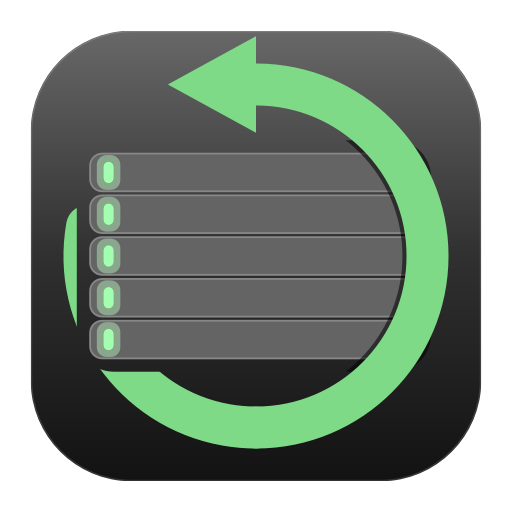
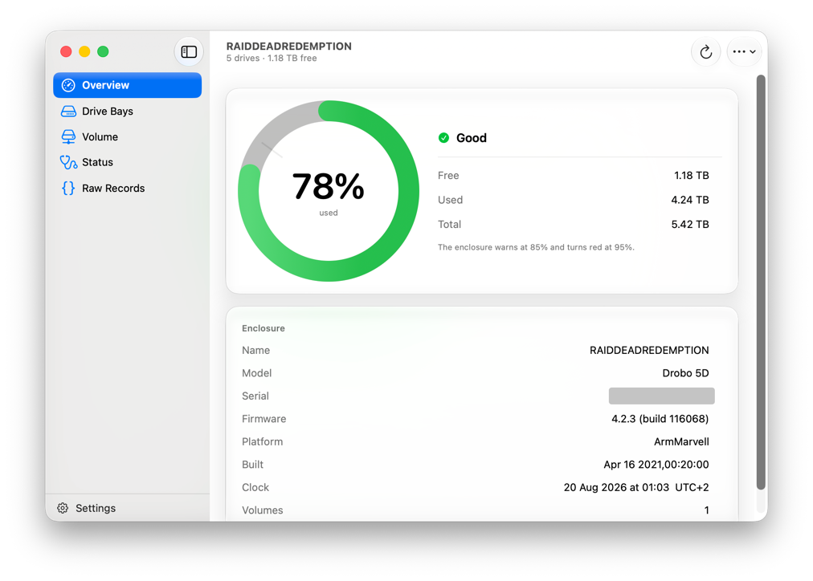
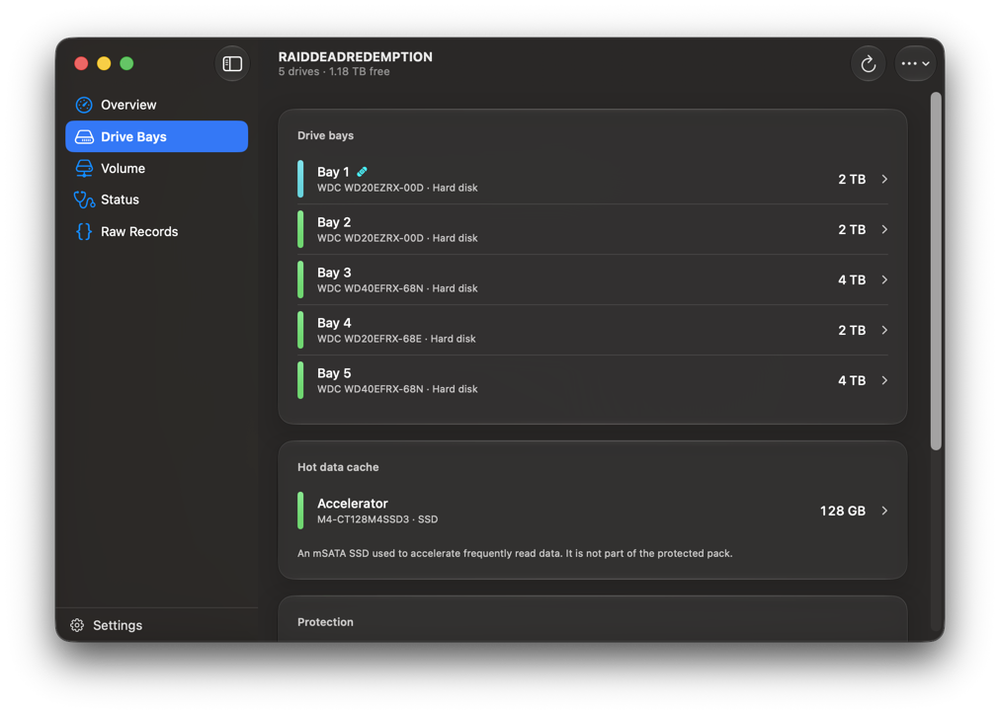

# ReDrobo

Reads a Drobo over USB and tells you what is actually inside it: real capacity,
drive bays, per-disk health. More or less what Drobo Dashboard used to show,
except on the Macs Dashboard stopped running on.

<br clear="left">

---

Drobo went into liquidation in 2023. The last Dashboard shipped in February
2021, tops out at macOS 11, is Intel-only, and leans on a kernel extension
nobody can sign or fix any more.

The enclosures themselves are fine. Over USB a Drobo mounts on any Mac without
help: what you lose is everything else (real capacity, bay status, health,
alerts). And that first one is not a detail. macOS will cheerfully tell you
there are 16 TB free on an array with 1.18 TB left, because a Drobo advertises
a thin-provisioned volume and keeps the truth on a management channel that
nothing on a modern Mac can speak.

ReDrobo speaks it again, with a DriverKit driver extension instead of a kext.

## Screenshots

| | |
|---|---|
|  |  |
| Capacity against the yellow and red thresholds the enclosure keeps for itself, and its own verdict on its own health. | The five bays with model and size, and the mSATA accelerator listed apart from them (it is a cache, not part of the protected pack). Each row opens for health, serial, firmware revision and wear. |

## What it shows

- Real capacity (free/used/total) against the yellow and red thresholds the
  enclosure keeps for itself
- Every drive bay: model and capacity, plus health, error count, serial number,
  firmware revision and wear where the firmware answers for them
- The status word decoded bit by bit against Drobo's own alert code, rather
  than guessed at
- The gap between what macOS believes and what the array has
- A menu bar item, and notifications when something changes (as opposed to
  notifications when something merely is)

## Caveats

Read this bit before you move straight on into installing.

**It will not run on a normal Mac.** A driver extension that publishes a service
needs a family entitlement from Apple, and until one is granted the driver only
loads on a machine with System Integrity Protection turned off and AMFI told to
look the other way. That is a real reduction in security for the whole machine
(not just for ReDrobo), so: use a spare Mac. The setup assistant walks you
through it and puts it back afterwards, but it cannot make it safe.

**It has been tested on exactly one enclosure**, a Drobo 5D on firmware 4.2.3,
by one person, on one Mac mini. The driver carries all 26 Vendor/Product pairs
Drobo's own kext matched on, so the other USB models should be picked up..
should, not does. The Thunderbolt and iSCSI ones cannot work at all (they
needed a virtual SCSI HBA kext, and DriverKit has no equivalent).

**It only reads.** No settings, no rename, no standby, no format, no firmware
update. The write protocol is decoded and deliberately not implemented; the
reasoning is in [docs/WRITING.md](docs/WRITING.md).

**Some of it is inference, and it says so.** Most of the protocol was recovered
from Drobo's own binaries rather than guessed at, but not all of it has been
confirmed against hardware, so [docs/PROTOCOL.md](docs/PROTOCOL.md) rates every
claim as confirmed / high confidence / open. Two examples: single versus dual
redundancy is derived from the capacities (no record reports it), and firmware
4.2.3 returns zero for every disk temperature, so the app shows nothing rather
than pretend your array is freezing.

**It cannot save your data.** BeyondRAID is undocumented and a disk pack can
only be read by another Drobo, so if the enclosure dies nothing here helps.
Keep a backup that is not on a Drobo: that was true before Drobo folded, and it
is more true now.

## If all you want is the real free space

Then you do not need any of this. macOS reports *used* space correctly, only
the total is hidden, and the total only changes when you swap a disk:

```bash
python3 tools/drobo-space.py --set-total <bytes> --volume /Volumes/YourDrobo
python3 tools/drobo-space.py
```

No driver, no SIP changes, no developer account. It will not tell you about a
failing disk, but it does stop the array filling up behind your back, which is
the part that actually bites.

## Building

You need Xcode 26 and a paid Apple Developer account.

```bash
cd ReDrobo && make && make install
```

Then open `/Applications/ReDrobo.app` and follow the setup assistant. The Mac
has to be restarted once the driver is installed, because macOS keeps running
the previous one until it is (this costs a debugging round roughly every time
you forget).

Other targets: `make check` runs the offline checks over the record decoding,
the status word tables and the redundancy derivation (no hardware needed),
`make icon` regenerates the app icon, `make signing` shows what got signed and
the state of the machine.

## Documentation

| | |
|---|---|
| [docs/PROTOCOL.md](docs/PROTOCOL.md) | The management protocol, field by field, with a confidence rating on every claim. |
| [docs/DRIVERKIT.md](docs/DRIVERKIT.md) | Getting a SCSI peripheral dext to work, and the traps that cost a day each. |
| [docs/TESTING.md](docs/TESTING.md) | Setting a Mac up to load a development driver, and putting it back afterwards. |
| [docs/WRITING.md](docs/WRITING.md) | The write path, decoded, and why none of it is implemented. |
| [docs/TEARDOWN.md](docs/TEARDOWN.md) | What the original Dashboard was made of. |

## Licence

MIT. Not affiliated with Drobo, Inc. or its successors: "Drobo" is used here
only to say what this thing talks to.
